# 50-l LArTPC Calibration Analysis

This repository contains the full analysis chain for the **50-l liquid
argon time-projection chamber (LArTPC) prototype** operated at CERN's
Building 182, together with a geometric optimisation tool for
**ProtoDUNE-HD** source placement.

The detector is instrumented with a **Bi-207 conversion-electron source**
for absolute energy calibration, electric field distortion studies, and
event-by-event liquid argon purity monitoring. **Cosmic ray (CR) muons**
provide an independent handle for charge equalization across collection
strips and a complementary electron lifetime measurement.

---

## Repository Structure

```
.
├── data_conversion/                   # Raw binary → JSON conversion
├── cr_analysis/                       # CR muon selection, equalization, lifetime
├── source_analysis/                   # Bi-207 source gain and peak studies
├── backgroud_simulation/              # Bi-207 background simulation (Fortran + Python)
├── find_best_source_position_protodune_hd/  # ProtoDUNE-HD source placement optimisation
├── output/                            # All analysis outputs (auto-populated)
├── setup_lxplus.sh                    # LCG_109 ROOT environment (lxplus)
└── setup_local.sh                     # Local Python environment setup
```

---

## Modules

### `data_conversion/` — Raw data conversion

Converts raw binary acquisition files into JSON format consumed by all
downstream analyses.

**Main scripts:**

| Script | Description |
|--------|-------------|
| `converter.py` | Single-run binary → JSON conversion |
| `convert_multiple_days.sh` | Batch conversion over multiple acquisition days |
| `sort_chn.py` | Re-orders channel indices to define a chn-strip map for correct event display |

**Running:**

```bash
cd data_conversion

# Convert a single run
python3 converter.py

# Batch conversion
bash convert_multiple_days.sh
```

**Output:** JSON files written to `../DATA/{dataset}/jsonData/`, which is
the expected input path for `cr_analysis/` and `source_analysis/`.

**Key includes (`inc/`):**

| Module | Role |
|--------|------|
| `raw_conv.py` / `rawto32chn.py` | Low-level binary decoding |
| `bin_to_json.py` / `saveBinToJSON.py` | Serialisation to JSON |
| `findPeaks.py` / `findPeaksCount.py` | Peak-finding utilities |
| `remove_coherent_noise.py` | Coherent noise subtraction |
| `settings.py` | Shared configuration (thresholds, channel map) |
| `show_event.py` / `singleEvtDisplay.py` / `simpleEventDisplay.py` | Event display helpers |

---

### `cr_analysis/` — CR muon analysis

Full cosmic ray muon pipeline: event selection, charge equalization, and
electron lifetime measurement. See [`cr_analysis/README.md`](cr_analysis/README.md)
for complete documentation.

**Pipeline summary:**

```
cr_step1_select.py   →  Event selection (track reconstruction, noise removal)
cr_step2_analyze.py  →  dQ/dx histograms, Landau⊗Gaussian fits, equalization
cr_step3_analyze.py  →  Electron lifetime from MPV vs drift time
cr_superposition.py  →  Superimposed 2D event display (all selected CR events)
```

**Quick start:**

```bash
cd cr_analysis

# Step 1 — local or lxplus
python3 cr_step1_select.py

# Steps 2–3 and superposition — require ROOT
source ../setup_lxplus.sh
python3 cr_step2_analyze.py
python3 cr_step3_analyze.py
python3 cr_superposition.py

## Output Structure

All analysis outputs are written under `output/`:

```
```
output/{dataset}/
├── csv/
│   ├── {dataset}-CR_events.csv
│   ├── {dataset}-CR_charges.csv
│   ├── {dataset}-CR_equalization.csv
│   └── {dataset}-CR_charges_equalized.csv
└── plots/
    ├── event_displays/
    ├── single_traces/
    ├── summary/
    └── step3/
        ├── langaus_slices/
        └── fit_range_scan/
```


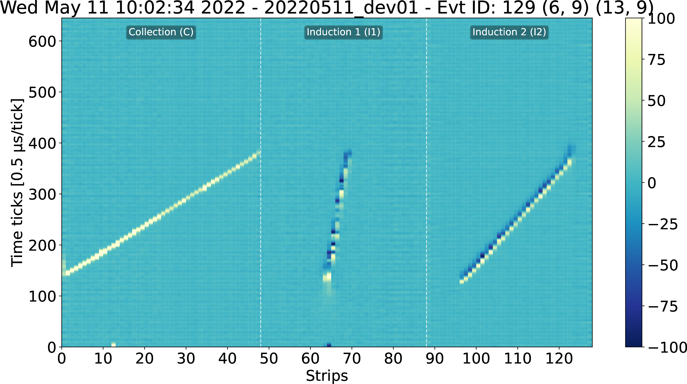


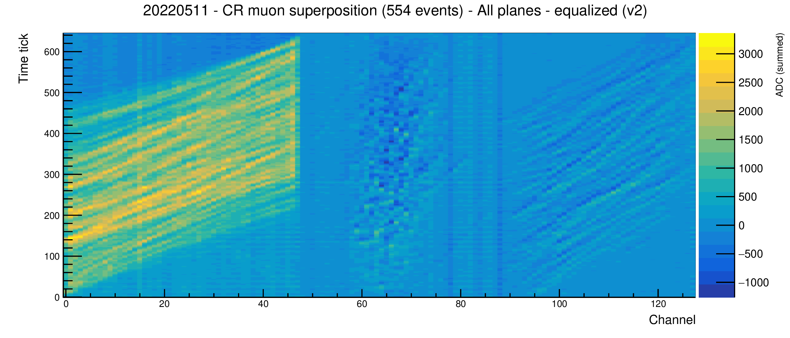

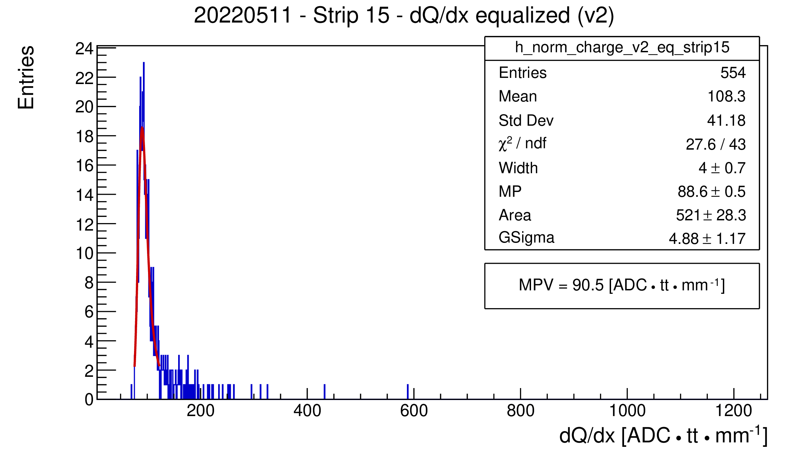

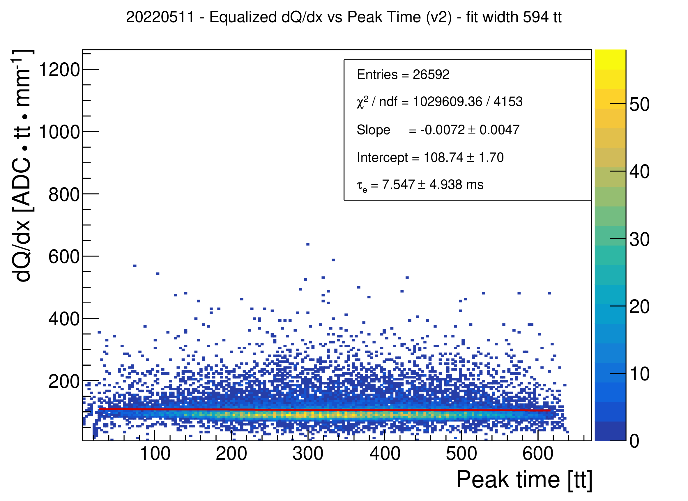

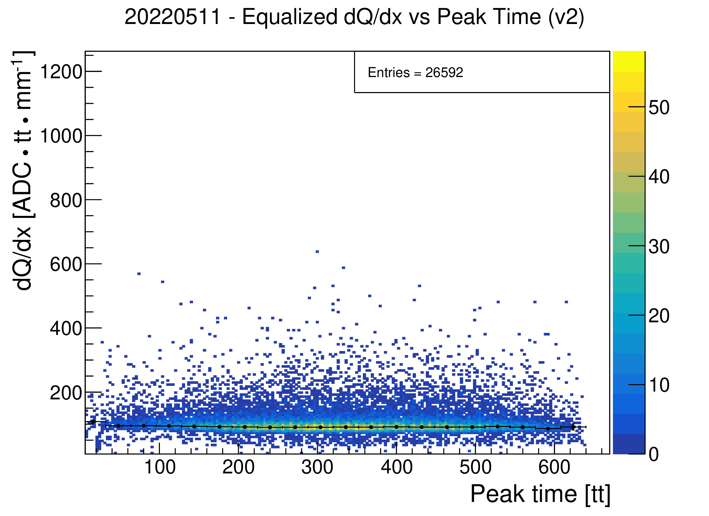

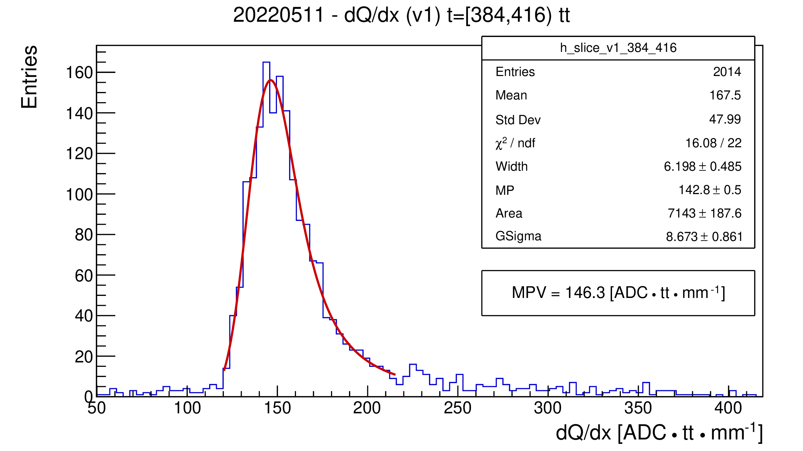


```
```
Configure dataset and analysis parameters in `config_cr.py`.

---

### `source_analysis/` — Bi-207 source analysis

Analyses data collected with the internal Bi-207 conversion-electron source. 

**Main scripts:**

| Script | Description |
|--------|-------------|
| `analysis_02.py` | Main analysis: peak identification and gain extraction |
| `analyze_csv.py` | CSV-based analysis of pre-processed peak data |
| `csv_to_charge_histo.py` | Charge histograms from CSV |
| `csv_to_charge_histo_standalone.py` | Standalone version (no external inc dependencies) |
| `csv_to_signal_bkg.py` | Signal vs background decomposition |
| `make_gif.py` | Animated event display (time-lapse of strip response) |
| `run_multiple_days.sh` / `run_multiple_days_2022.sh` | Batch processing over multiple datasets |

**Running:**

```bash
cd source_analysis

# Single-dataset analysis
python3 analysis_02.py

# Batch over multiple days
bash run_multiple_days.sh
```

**Key includes (`inc/`):**

| Module | Role |
|--------|------|
| `basic_functions.py` | Baseline subtraction, waveform utilities |
| `find_peaks_50l.py` | Peak finder tuned for 50-L detector |
| `find_charge_cluster.py` | Charge cluster identification |
| `filter_data.py` | Run-level quality filtering |
| `prepare_data.py` | Data loading and preprocessing |
| `read_data.py` | JSON file reader |
| `draw_summary_plots.py` | Summary plot generation |
| `csv_to_charge_histo.py` | Histogram builder from CSV |
| `remove_coherent_noise.py` | Coherent noise removal |
| `store_info.py` | Result serialisation |
| `analyze_single_strips.py` | Per-strip gain and peak analysis |
| `show_event.py` / `single_evt_display.py` | Event display |
| `settings.py` | Thresholds, channel map, output paths |

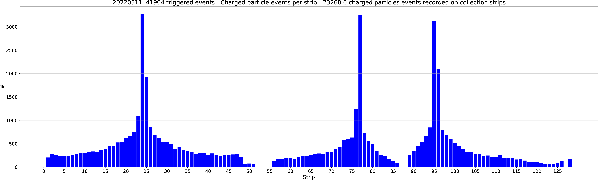

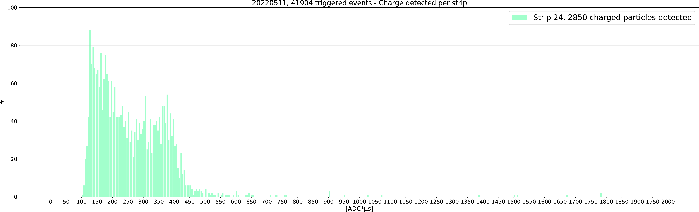

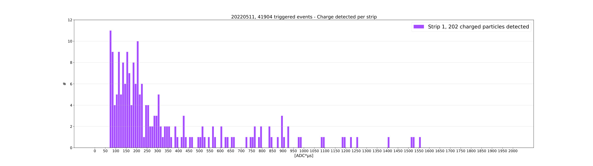

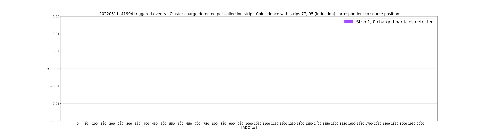

---

### `backgroud_simulation/` — Bi-207 background simulation

Simulates the expected background contributions to the Bi-207 source
spectrum, providing reference distributions for signal/background
separation in `source_analysis/`.

Two independent implementations are provided:

#### Fortran (`fortran/`)

| File | Description |
|------|-------------|
| `bi207bg.f` | Main Fortran simulation |
| `fort.91`–`fort.98` | Simulation output tables |
| `o.out` | Compiled binary output |

**Compile and run:**
```bash
cd backgroud_simulation/fortran
gfortran -o bi207bg bi207bg.f
./bi207bg
```

#### Python (`python/`)

| Script | Description |
|--------|-------------|
| `Bi207bg.py` | Python port of the background simulation |
| `ElectronArrivalChn.py` | Electron arrival distribution per channel |
| `ElectronArrivalXY.py` | Electron arrival distribution in XY |
| `PhotonArrivalChn.py` | Photon arrival distribution per channel |
| `PhotonArrivalXY.py` | Photon arrival distribution in XY |
| `ReadChannels.py` | Channel map reader |
| `inc/GV.py` | Global variables and detector geometry constants |

**Running:**
```bash
cd backgroud_simulation/python
python3 Bi207bg.py
```

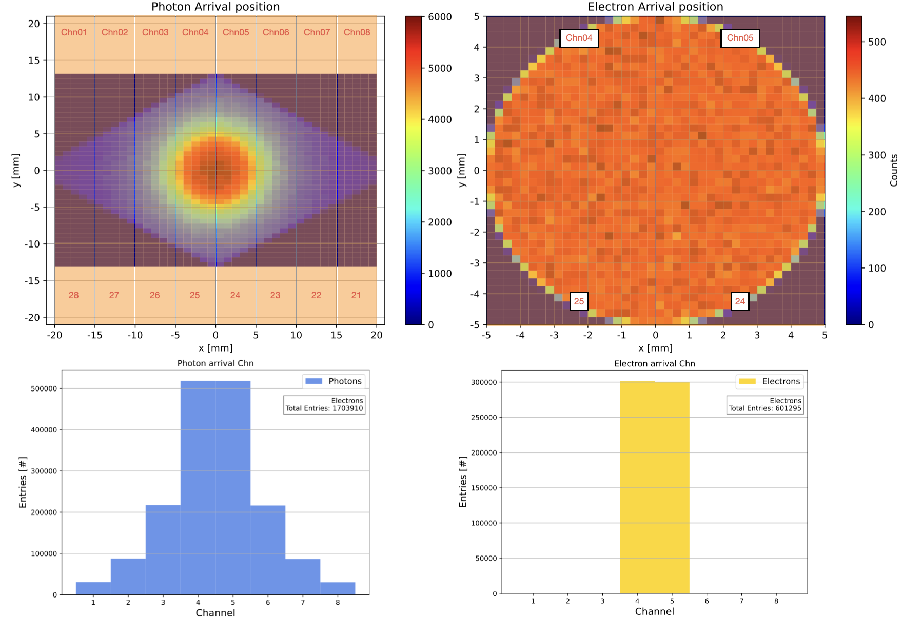

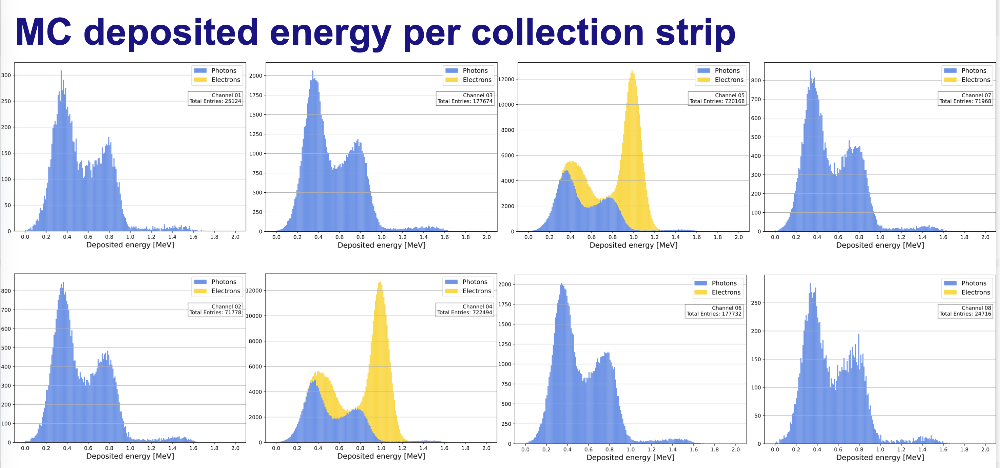

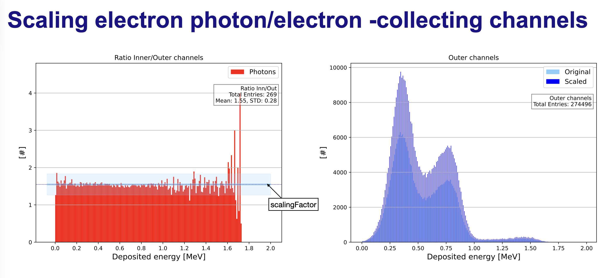

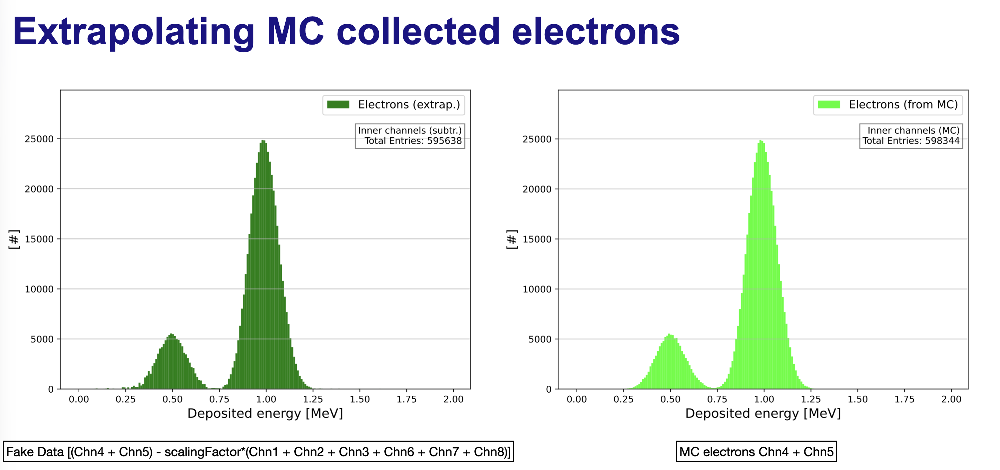

---

### `find_best_source_position_protodune_hd/` — ProtoDUNE-HD source placement

Geometric optimisation tool that identifies the optimal placement of a
radioactive source inside the **ProtoDUNE-HD** detector, maximising
wire-plane coverage and signal uniformity across APA frames.

**Scripts:**

| Script | Description |
|--------|-------------|
| `main.py` | Entry point: runs the optimisation and reports best positions |
| `apa_frame.py` | APA frame geometry definition |
| `wire_plane.py` | Wire plane geometry and acceptance model |
| `wire.py` | Individual wire representation |
| `point.py` | 3D point / position class |
| `segment.py` | Line segment utilities (track projections) |
| `utils.py` | Shared geometric helpers |

**Running:**

```bash
cd find_best_source_position_protodune_hd
python3 main.py
```

---

## Output Structure

All analysis outputs are written under `output/`:

```
output/{dataset}/
├── csv/
│   ├── {dataset}-CR_events.csv
│   ├── {dataset}-CR_charges.csv
│   ├── {dataset}-CR_equalization.csv
│   └── {dataset}-CR_charges_equalized.csv
└── plots/
    ├── event_displays/
    ├── single_traces/
    ├── summary/
    └── step3/
        ├── langaus_slices/
        └── fit_range_scan/
```

Dataset directories in `output/` follow the naming convention
`{date}_{config}_{noise_treatment}`, e.g. `20220511_ALL_noCNR`.

---

## Environment Setup

### lxplus (ROOT required — Steps 2/3 of CR and source analyses)

```bash
source setup_lxplus.sh   # sources LCG_109, sets PYTHONPATH
```

### Dependencies summary

| Package | Used in |
|---------|---------|
| Python ≥ 3.10 | all modules |
| NumPy, SciPy | cr_analysis Step 1, source_analysis |
| Matplotlib | event displays |
| ROOT / PyROOT | cr_analysis Steps 2–3, source_analysis histograms |
| gfortran | backgroud_simulation/fortran |

---

## Data

Raw acquisition data is expected at:
```
../DATA/{dataset}/jsonData/
```
relative to each analysis directory. JSON files are produced by
`data_conversion/`. The `DATA/` folder is not tracked in this repository. 

---

